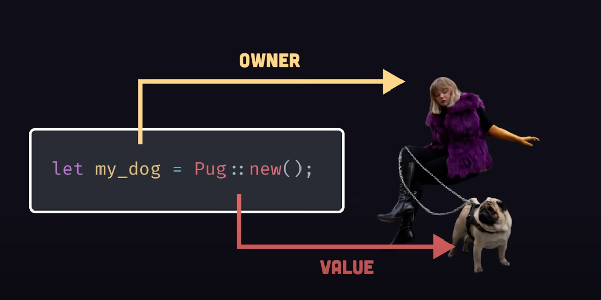
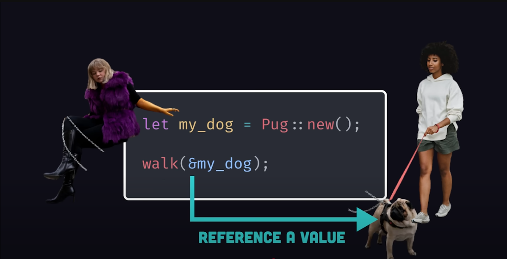
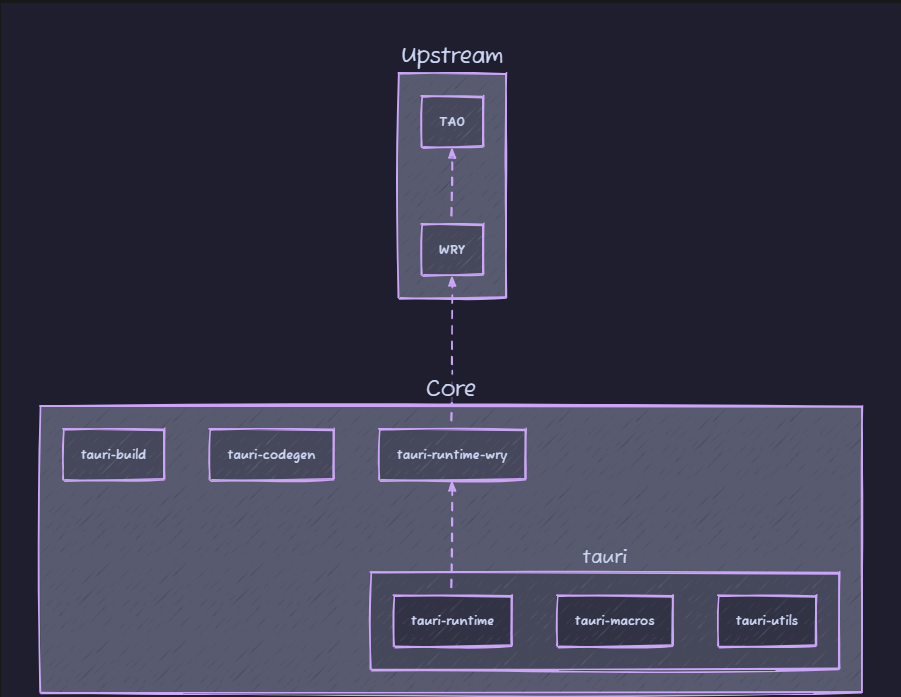
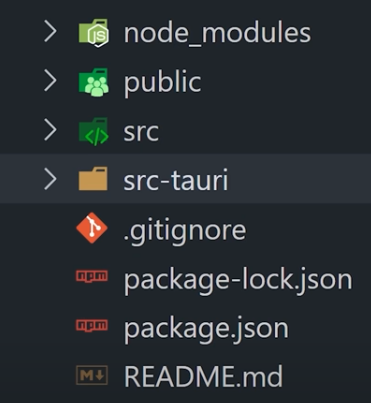
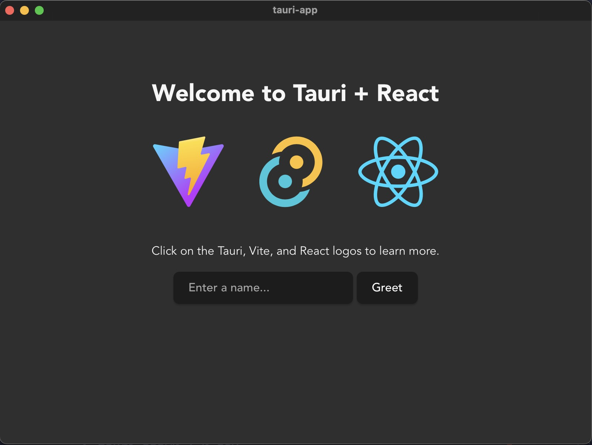
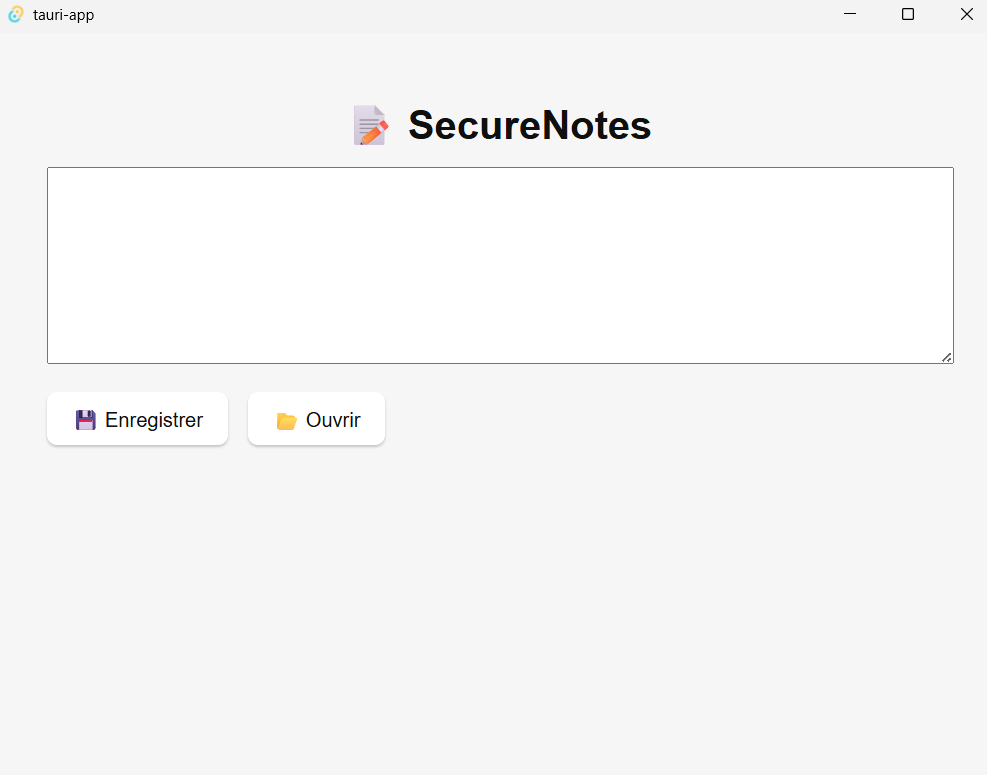

---

## Prérequis

Si vous avez docker : 
🔗 https://sourceforge.net/projects/vcxsrv/  
➡️ Lancer **VcXsrv** avant de démarrer l'app via Docker


Si vous **n'avez pas Docker** :  
📥 Installez :
- Visual Studio C++ Build Tools  
- Rustup 
🔗 https://www.rust-lang.org/tools/install

---

## Pourquoi Electron a été créé ? ⚙️

- Besoin de créer des apps **desktop multiplateformes** avec des compétences web
- Utilise :
  - **Node.js** pour le backend
  - **Chromium** pour le rendu UI
- Objectif : développement rapide avec JavaScript

**Exemples célèbres** : VS Code, Discord, Slack

---

## Qu'est-ce que Tauri ? 🦀

- Framework pour apps desktop **ultra-légères**
- Frontend : HTML/CSS/JS (React, Vue, etc.)
- Backend : écrit en **Rust**
- Utilise le **WebView natif** du système, pas Chromium

---

## Pourquoi Tauri plutôt qu'Electron ? ⚖️

| Critère          | Electron         | Tauri             |
|------------------|------------------|-------------------|
| Poids app        | 100–200 Mo       | 3–10 Mo           |
| Performance      | Gourmand         | Léger, rapide     |
| Sécurité         | Moyenne          | Élevée            |
| Backend          | Node.js (JS)     | Rust              |
| WebView          | Chromium         | Natif             |
| Maturité         | Élevée           | Jeune, prometteur |

---

## Spécificités de Tauri ✨

- Très **léger**
- Écrit en **Rust**
- Sécurité renforcée (isolation, permissions)
- Modularité (importe que ce qui est utile)
- Intégration native (menu, notifs, raccourcis)
- Communication **Rust ↔️ JS**

---

## En résumé 📝

**Electron** ✅  
✔ Mature et stable  
✔ Facile pour devs JS

**Tauri** 🦀  
✔ Léger et rapide  
✔ Sécurisé par design  
✔ Rust = plus complexe, mais puissant

---

## Tauri et Rust 🦀

- Le **backend** de Tauri est écrit en **Rust**
- Rust = langage système moderne :
  - 🔐 **Sécurité mémoire** avec un concept d'ownership et de borrowing
  - ⚡ **Haute performance**
  - 🧩 **Conception modulaire**

> Rust évite les crashs et bugs classiques liés aux pointeurs et à la gestion manuelle de mémoire

---

## Ownership



---

## Borrowing 



---

Qu’est-ce que let mut en Rust ?
Par défaut, les variables en Rust sont immuables (non modifiables).

Quand on écrit simplement :
```rust
let x = 5;
```

On ne peut pas changer x ensuite :

```rust
x = 6; // ❌ ERREUR : cannot assign twice to immutable variable
✅ Solution : rendre une variable mutable
```

---

On utilise alors mut :

```rust
let mut x = 5;
x = 6; // ✅ autorisé
```

Le mot-clé mut signifie donc "je veux pouvoir modifier cette variable plus tard".

---

## Architecture interne de Tauri 🏗️

Tauri repose sur deux composants internes :

### 🧱 **Tao**
- Abstraction native multiplateforme pour :
  - Fenêtres
  - Événements systèmes
  - Menu / raccourcis / dialogues
- Alternative légère à Electron

---

### 🌐 **Wry**
- Intègre un **WebView natif** :
  - **WebKit** sur macOS/Linux
  - **WebView2** (Edge) sur Windows
- Gère la communication JS ↔ Rust

---

## Architecture



---

## Explications

**Tauri** : C’est la grande caisse qui tient tout ensemble. Elle réunit les temps d’exécution, les macros, les utilitaires et l’API en un seul produit final. Il s'occupe de la gestion de la configuration, de l'injection de script, il héberge l'API et gère aussi les mise à jour.

**Tauri-runtime-wry** : Cette caisse ouvre des interactions directes au niveau du système spécifiquement pour WRY, telles que l’impression, la détection d'écran, et d’autres tâches liées au fenêtrage.

**Upstream** : TAO pour la création et la gestion des fenêtres d’application, et WRY pour l’interfaçage avec le Webview qui vit dans la fenêtre.

---

## Sécurité dans Tauri 🔐

Tauri a été **conçu autour de la sécurité** :

✅ WebView isolé  
✅ Permissions explicites par API  
✅ Aucune API système exposée par défaut  
✅ Communication contrôlée (commandes Rust uniquement déclarées)  
✅ Code signé et vérifiable  
✅ Mise à jour sécurisée (chiffrement + signature)

---

## Comment créer une app Tauri ?

npm create tauri-app@latest



---

macOS :


---

Windows : 


---

## Merci 🙌

Des questions ?  

---

## Set up TP

Github : https://github.com/Insu-qg/Tauri

si vous êtes sur docker :

Build :

```bash
docker build -t tauri-builder .
```
Run :
```bash
docker run -it --rm -e DISPLAY=host.docker.internal:0.0 -v "${PWD}:/app" tauri-builder
```

sinon : 

```bash
npm run tauri dev
```

---

## TP

Des aides sont fournies plus bas.

### 1

Crée une application Tauri appelée SecureNotes :

L'interface (frontend) doit contenir :

- Un champ textarea pour écrire des notes

- Deux boutons : “Enregistrer” et “Ouvrir”

En appuyant sur “Enregistrer” :

- Le contenu du textarea est envoyé à Rust via invoke()

- Rust enregistre le fichier localement (nom par défaut : note.txt)

En appuyant sur “Ouvrir” :

- Rust lit le fichier note.txt

- Le contenu est renvoyé au frontend pour l'afficher dans le textarea

Sécurise l’API :

- N’autoriser que des fichiers .txt

- Bloquer les chemins absolus (pas d’accès arbitraire au disque)

### 2

Objectif :

Tu veux sauvegarder une note chiffrée dans un fichier (note.txt).

Et pouvoir la déchiffrer à la lecture.

Le chiffrement doit se faire côté Rust, pas React (meilleure sécurité).

tu dois utiliser aes-gcm pour réaliser cela.

### 3 
 
Appel natif :

faire en sorte d'avoir une notification quand vous sauvegardez un fichier
pensez aussi à build l'app !

```Bash
npm run tauri build  
```


## Documentation pour vous aider

https://tauri.app/plugin/

## Aides supplémentaires


### 1

exemple de création d'un fichier avec Rust :

```Rust
use std::fs::File;
use std::io::Write;

fn main() -> std::io::Result<()> {
    // On crée un fichier nommé "exemple.txt"
    let mut fichier = File::create("exemple.txt")?;

    // On écrit du texte dans le fichier
    fichier.write_all(b"Bonjour, ceci est un fichier créé par Rust.")?;

    println!("Fichier créé avec succès !");
    Ok(())
}
```

lire un fichier avec Rust :

```Rust
use std::fs::File;
use std::io::{self, Read};

fn main() -> io::Result<()> {
    // On ouvre le fichier existant
    let mut fichier = File::open("exemple.txt")?;

    // On crée une variable pour stocker le contenu
    let mut contenu = String::new();

    // On lit le fichier dans la variable
    fichier.read_to_string(&mut contenu)?;

    // On affiche ce qu'on a lu
    println!("Contenu du fichier :\n{}", contenu);
    
    Ok(())
}
```


```bash
npm install @tauri-apps/plugin-fs
```

config :

```json
{
  "plugins": {
    "fs": {
      "scope": ["./note.txt"]
    }
  }
}
```

### 2

dans les dépendances de rust (Cargo.toml) :

ajouter à [dependencies] :

aes-gcm = "0.10"
base64 = "0.21"


### 3

```bash
npm install @tauri-apps/api
```

un exemple est disponible dans la documentation de Tauri.


### Bonus (exemple de code)

```Rust
#![cfg_attr(not(debug_assertions), windows_subsystem = "windows")]

#[tauri::command]
fn process_note(note: &str) -> String {
    // Ici, on emprunte la note sans en prendre possession.
    // Rust évite de copier inutilement la donnée.
    format!("Note reçue (empruntée) : {}", note)
}

fn main() {
    tauri::Builder::default()
        .invoke_handler(tauri::generate_handler![process_note])
        .run(tauri::generate_context!())
        .expect("Erreur au lancement de Tauri");
}
```


```Typescript
import { useState } from "react";
import { invoke } from "@tauri-apps/api/core";

function App() {
  const [note, setNote] = useState("");
  const [response, setResponse] = useState("");

  const handleSend = async () => {
    const result = await invoke<string>("process_note", { note });
    setResponse(result);
  };

  return (
    <div style={{ padding: "2rem" }}>
      <h1>📝 SecureNotes - Démo Invoke + Borrowing</h1>
      <textarea
        rows={10}
        cols={50}
        value={note}
        onChange={(e) => setNote(e.target.value)}
        style={{ width: "100%", marginBottom: "1rem" }}
      />
      <div>
        <button onClick={handleSend}>Envoyer à Rust</button>
      </div>
      <p style={{ marginTop: "1rem", fontStyle: "italic" }}>
        Réponse de Rust : {response}
      </p>
    </div>
  );
}

export default App;
```

&str = il emprunte juste une vue en lecture des données (plus rapide, plus sûr).

Ici, on ne veut que lire la note, donc &str est plus approprié.


gestion de plugin de notification et aide sur le main: 

```Rust
fn main() {
    tauri::Builder::default()
        .plugin(tauri_plugin_notification::init())
        .invoke_handler(tauri::generate_handler![save_note, load_note])
        .run(tauri::generate_context!())
        .expect("Erreur au lancement de l'app");
}
```
